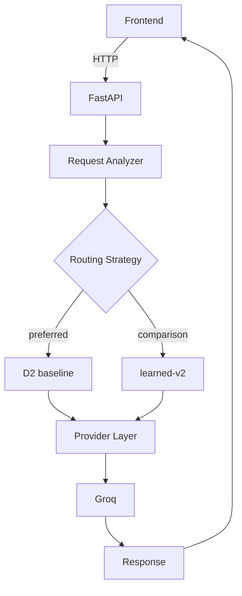

# Switchyard

Adaptive multi-model AI routing: send each request to the model that fits
it, not the same model every time.

## Problem

Sending every request to the strongest, most expensive model is wasteful
when many requests don't need it — a one-line extraction task and a
multi-step reasoning task rarely deserve the same model. The alternative,
always using the cheapest model, risks quality on the requests that do
need more capability. Switchyard exists to find a routing policy between
those two extremes, and to measure — not assume — what it actually costs
in quality, latency, and price.

## Research question

Can task-aware routing preserve answer quality while reducing cost and
latency?

## Result

**D2 matched always-120b's 90.2% benchmark accuracy while routing only
6.5% of requests to 120B, reducing nominal cost by 45.5% and average
latency by 29.8%, on the 92 automatically graded benchmark tasks.**

This is a measured result on Switchyard's own 92-task automatically
graded evaluation set — not a general claim about routing, and not a
claim that holds on a different task distribution or a paid deployment.
See [Limitations](#limitations) and [What didn't work](#what-didnt-work)
before generalizing it.

## Architecture



Full diagram (including the learned-router training flow) and the
reasoning behind each piece: [`docs/architecture/overview.md`](docs/architecture/overview.md).

## How routing works

Two strategies matter in production; several more exist purely for
comparison and are always visible as such in the Playground and Compare
page.

- **D2 baseline** (`d2-baseline`, preferred) — one rule:
  `summarization -> groq-gpt-oss-120b`, everything else ->
  `groq-gpt-oss-20b`. No trained model, no hidden state — the entire
  policy is one line, and it is LOOCV-validated against the benchmark
  rather than fit in-sample.
- **learned-v2** (kept selectable for comparison, not preferred) — a
  shallow decision tree trained to predict whether a request should
  escalate from the 20B model to the 120B model, using only
  pre-execution features (category, difficulty, structured-output flag,
  estimated tokens). See [What didn't work](#what-didnt-work) for why
  this doesn't beat D2.

A perfect oracle strategy also appears on the Compare page, but only as a
**theoretical upper bound** — it requires already knowing the correct
answer and is never selectable as a real routing strategy.

## Benchmark

104 tasks across 8 categories (extraction, classification, summarization,
math, reasoning, coding, debugging, structured_output), run against
`groq-gpt-oss-20b` and `groq-gpt-oss-120b`.

- **92** automatically graded (exact match, classification-label
  matching, structured-output/JSON validation, execution-based
  sandboxed tests for coding/debugging, required-fact presence checks
  for summarization).
- **12** manual-only — no deterministic grader could distinguish correct
  from incorrect without either resolving a genuine specification
  ambiguity or fabricating a rubric. This is a documented limitation of
  the benchmark, not something hidden: see the Benchmarks page and
  `docs/case-study/DECISIONS.md`.
- **0** ungraded.

Full per-category breakdown and the exact reasoning per manual-only task:
the in-app Benchmarks page (`/benchmarks`) and
`docs/case-study/EXPERIMENTS.md`.

## Results

Measured on the 92 automatically graded benchmark tasks (LOOCV where
applicable — see `docs/case-study/DECISIONS.md`, 2026-09-24/27):

| Strategy | Accuracy | Nominal cost | Avg latency | 20B usage | 120B usage |
|---|---|---|---|---|---|
| always-20b | 88.0% | $0.008108 | 646ms | 100% | 0% |
| always-120b | 90.2% | $0.015020 | 927ms | 0% | 100% |
| **D2 baseline (preferred)** | **90.2%** | **$0.008193** | **651ms** | 93.5% | 6.5% |
| learned-v2 | 88.0% | $0.009477 | 687ms | 76.1% | 23.9% |
| perfect oracle (theoretical upper bound, not implementable) | 93.5% | $0.008187 | 655ms | 94.6% | 5.4% |

Actual billed API cost for this benchmark was $0.00 (Groq free tier) —
"nominal cost" above is computed from Groq's published per-token pricing
and does not represent paid-deployment economics. Full detail, including
why LOOCV was used and how the oracle is computed:
`docs/case-study/METRICS.md` and `docs/case-study/EXPERIMENTS.md`.

## What didn't work

Learned routing was expected to outperform a simple rule. It didn't:
`learned-v2` reached 88.0% LOOCV accuracy against D2's 90.2%, on the same
92 tasks, using more model calls to the larger model (23.9% vs. D2's
6.5%) to get a worse result.

The likely reason: only a small number of tasks in the benchmark
contained predictable model disagreement (8 tasks where the two models'
correctness actually differed, 5 of them positive/escalate examples) —
too little signal for a learned classifier to find a policy better than
the single-category rule D2 already found. This is treated as a real,
reported finding, not a bug to fix: `learned-v2` stays fully integrated
and selectable for comparison, and D2 remains the preferred production
strategy. See `docs/case-study/DECISIONS.md` (2026-09-27) for the full
analysis.

## Running locally

### Backend

```bash
cd backend
python3 -m venv .venv
source .venv/bin/activate
pip install -r requirements-dev.txt
uvicorn app.main:app --reload
```

Visit `http://localhost:8000/health` or `http://localhost:8000/docs`.
Benchmark tasks and the model registry sync into a local SQLite database
(`backend/switchyard.db`) automatically on startup — no manual migration
step.

### Frontend

```bash
cd frontend
npm install
npm run dev
```

Visit `http://localhost:3000`. Requires the backend at the URL in
`NEXT_PUBLIC_API_BASE_URL` (defaults to `http://localhost:8000`).

### Environment variables

Copy `.env.example` to `.env` (backend) and/or `frontend/.env.local`.
Nothing is required to run the app: without `GROQ_API_KEY`, the Playground
shows a clear "live routing requires a Groq API key" state, D2/learned-v2
selection falls back to the mock provider tier, and every other page
(Overview, Compare, Models, Benchmarks, Experiments) still works fully —
all of their real numbers come from the committed benchmark results, not
live traffic. See [Demo mode](#demo-mode) below.

| Variable | Where | Required | Purpose |
|---|---|---|---|
| `GROQ_API_KEY` | backend | no | Enables real routed requests to `groq-gpt-oss-20b`/`120b` |
| `OPENAI_API_KEY` / `ANTHROPIC_API_KEY` / `GOOGLE_API_KEY` / `XAI_API_KEY` | backend | no | Enable other registered provider adapters, unused by D2/learned-v2 |
| `DATABASE_URL` | backend | no | Defaults to local SQLite (`sqlite:///./switchyard.db`) |
| `ENVIRONMENT` / `DEBUG` | backend | no | Runtime environment label / debug flag |
| `NEXT_PUBLIC_API_BASE_URL` | frontend | no | Defaults to `http://localhost:8000` |

### Demo mode

The app is designed to be explored by a recruiter or reviewer with no API
key at all: historical benchmark results, Compare, Models, Benchmarks,
and Experiments are all backed by committed data, not live calls. The
Playground clearly states when live routing is unavailable and never
crashes or exposes backend configuration details; it also offers a
labeled, static example routing trace so the full pipeline (analysis ->
routing decision -> execution -> trace) is understandable without a key.

### Running an experiment

```bash
curl -X POST http://localhost:8000/experiments \
  -H "Content-Type: application/json" \
  -d '{"task_ids": ["math-001"], "model_config_ids": ["groq-gpt-oss-20b", "groq-gpt-oss-120b"]}'
```

### Routing a request

```bash
curl -X POST http://localhost:8000/route \
  -H "Content-Type: application/json" \
  -d '{"prompt": "Summarize this in one sentence: ...", "router_version": "d2-baseline"}'
```

`router_version` accepts `d2-baseline` (preferred), `learned-v2`,
`always-20b`, `always-120b`, or the legacy `v2`/`learned-v1`.

## Training the router

`learned-v2` is trained offline from the committed benchmark results, not
at request time. To reproduce it exactly:

```bash
cd backend && source .venv/bin/activate
python ../scripts/train_router.py
```

This is deterministic (fixed `random_state=0`) and writes
`backend/app/routing/learned/artifacts/learned-v2.joblib` and its
manifest. Per the current project stage, this router is **not** being
retrained as part of V4 — the command above is documentation of how
`learned-v2` was produced, not an instruction to re-run it.

## Tests

```bash
cd backend && source .venv/bin/activate && pytest
```

250 backend tests currently pass, covering routing decisions (all
strategies), evaluation/validation logic, provider adapters, the
experiment runner, and the new V4 API surface
(`benchmark_performance`, `/benchmarks/coverage`, fixed-model routers).

Frontend:

```bash
cd frontend && npm run typecheck && npm run lint && npm run build
```

## Limitations

- Small benchmark (104 tasks, 92 automatically graded) — not a
  production-scale evaluation set.
- Only two models are realistic production candidates
  (`groq-gpt-oss-20b`/`120b`); a third registered model
  (`groq-qwen3.8-27b`) is not called by any router.
- The benchmark's category distribution may not represent real
  production traffic.
- 12 tasks remain manual-only; no automated ground truth exists for them
  yet.
- The measured $0.00 billed cost reflects Groq's free tier during
  development, not paid-deployment economics — "nominal cost" throughout
  this project is computed from published per-token pricing, not an
  actual invoice.
- The learned router was trained on only 8 tasks with observed
  model disagreement (5 positive examples); that sample size is too
  small to draw strong conclusions about learned routing in general,
  only about this specific dataset.

## Future work

Realistic next steps, not features already built:

- Expand the benchmark's category coverage and task count, particularly
  where model disagreement is currently sparse, before revisiting
  learned routing.
- Grade the remaining 12 manual-only tasks once a defensible automated
  method exists for each.
- Evaluate a third model's actual marginal value on the specific tasks
  where both current models fail together, rather than on general
  capability claims.
- Move router-comparison analytics from a static manifest to a
  recomputed view once meaningful live traffic accumulates on a real
  deployment.

## Contributing / working on this repo

Read `CLAUDE.md` for engineering principles and documentation
requirements, and `PROJECT_STATE.md` before starting any non-trivial
change.
