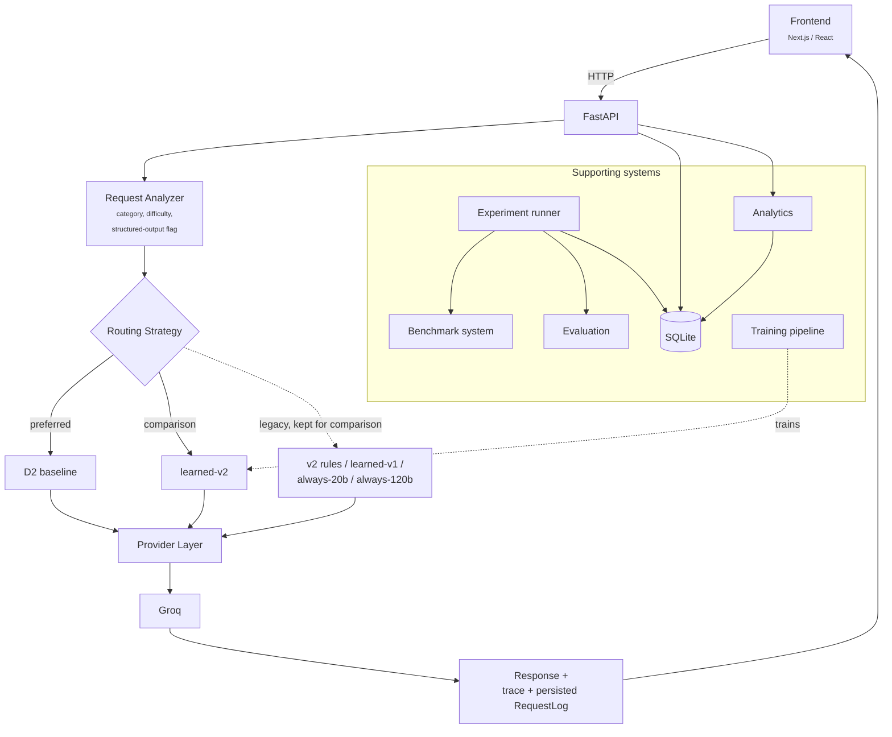
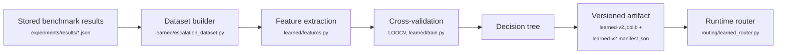

# Architecture overview

Status: V4 (final product / deployment stage). Research is frozen as of
V3 — this document describes the system as shipped, not a work in
progress. See `PROJECT_STATE.md` for the current stage and
`docs/case-study/DECISIONS.md` for why each piece exists.

## Request flow

Every routed request — from the Playground or any future caller — moves
through the same pipeline, regardless of which routing strategy is
selected:



Each stage, in code:

```
raw prompt
  -> app/routing/analyzer.py        analyze_request(): category, difficulty,
                                     structured-output flag, estimated tokens
                                     — transparent heuristics, not a model.
  -> app/routing/service.py         handle_routed_request() dispatches to the
                                     selected strategy by router_version:
       -> d2_router.py                D2_ROUTER_VERSION = "d2-baseline"
                                       (preferred — see decision below)
       -> learned_router.py           learned-v2 (V3's trained decision tree;
                                       kept selectable for direct comparison,
                                       does not beat D2 — see below)
       -> escalation_router.py        experimental escalation variant
       -> fixed_model_router.py       always-20b / always-120b (fixed
                                       single-model baselines, for comparison)
       -> router.py + rules.py        "v2": original rule-based router
                                       (pre-V3, kept for history)
  -> app/providers/registry.py      resolves the chosen model to a Provider
  -> app/providers/*.py             GroqProvider (real) or MockProvider
                                     (deterministic, no key required)
       |-> app/evaluation/validation.py   validate_response() — checks the
       |                                  live response against whatever can
       |                                  be inferred from the request itself
       |-> app/routing/trace.py           TraceEvent — system facts only,
       |                                  never model reasoning
  -> RequestLogORM                  one row per request: analysis + decision
                                     + escalation history + execution + trace
```

`service.py`'s `MAX_ATTEMPTS`-bounded retry loop escalates on a provider
error or a failed validation, regardless of which strategy picked the
first model — escalation is a property of the service layer, not of any
one strategy.

## Routing strategies

Two strategies matter for production; the rest exist for comparison and
are documented in `docs/case-study/DECISIONS.md` and `EXPERIMENTS.md`:

- **D2 baseline** (`d2-baseline`, `routing/d2_router.py`) — the preferred
  strategy. One rule: `summarization -> groq-gpt-oss-120b`, everything
  else -> `groq-gpt-oss-20b`. No trained artifact; fully auditable in one
  line. Matches always-120b's measured accuracy while sending only 6.5%
  of benchmark requests to the larger model.
- **learned-v2** (`routing/learned_router.py`) — V3's trained decision
  tree, kept selectable in the Playground for direct comparison. It did
  **not** outperform D2 (88.0% vs. 90.2% LOOCV accuracy) — an intentional,
  documented negative result, not a bug to fix in V4.
- **always-20b / always-120b** (`routing/fixed_model_router.py`) — fixed
  single-model baselines used only for comparison, never presented as
  recommended production strategies.
- **v2 / learned-v1** — earlier, superseded strategies kept selectable for
  historical continuity, not recommended.

The perfect oracle strategy shown on the Compare page is **not** one of
these — it requires already knowing the correct answer and has no
corresponding entry in `service.py`'s dispatch table. It is a theoretical
upper bound computed offline for comparison, never an implementable or
selectable routing strategy.

## Learned-router training flow

`learned-v2` is produced offline, not at request time:



Run with `python scripts/train_router.py` (see the README's "Training the
Router" section for the exact reproducible command and its inputs). The
manifest it writes — accuracy, cost, latency, per-strategy comparison
against D2/always-20b/always-120b/oracle — is the single source read by
both `GET /analytics/router-comparison` and the frontend Compare page;
none of those numbers are duplicated as frontend constants.

## Repository shape

- `frontend/` — Next.js/React/TypeScript. UI only; no business logic.
- `backend/` — FastAPI/Python. Owns routing, provider adapters, evaluation,
  persistence, and experiment execution.
- `benchmarks/` — versioned task definitions used as evaluation input.
- `experiments/` — recorded configuration/results from experiment runs,
  including the committed 104-task Groq benchmark results that back every
  real number shown in the product (see "Why read committed results
  directly" below).
- `docs/` — architecture notes and the running case study.
- `scripts/` — one-off developer scripts (benchmark runs, router training,
  coverage reports), not application code.

The frontend and backend communicate over HTTP; nothing else currently
links them together.

## Backend internal structure

`backend/app/` is organized by responsibility rather than by feature:

- `api/` — HTTP route definitions (`benchmarks.py`, `model_configs.py`,
  `experiments.py`, `routing.py`, `analytics.py`, `health.py`), plus
  request/response schemas kept separate from the ORM layer
  (`schemas.py`).
- `core/` — configuration (`config.py`) and cross-cutting helpers
  (`time.py`).
- `models/` — `BenchmarkTaskORM`, `ModelConfigORM`,
  `ExperimentRunORM`/`ModelExecutionORM`, `RequestLogORM`, and the shared
  enums (`TaskCategory`, `TaskDifficulty`, `EvaluationType`,
  `ExecutionStatus`, `EvaluationStatus`, `RunStatus`, `ValidationStatus`,
  `ConfidenceLevel`).
- `providers/` — the `Provider` interface, `MockProvider`, the real Groq
  provider, pure cost estimation (`pricing.py`), and the single model
  registry (`registry.py`).
- `evaluation/` — `strategies.py` (grading a benchmark task against its
  pre-authored `expected_output`) and `validation.py` (checking a *live*
  routed response with no pre-authored answer to check against).
- `experiments/` — `loader.py` (syncs benchmark task files into the DB),
  `runner.py` (executes experiment runs), and `results_reader.py` (reads
  the committed benchmark results JSON directly — see below).
- `db/` — SQLAlchemy engine/session, the declarative base, table creation.
- `routing/` — `analyzer.py`, `router.py`/`rules.py` (original V1/V2
  rules), `d2_router.py`, `escalation_router.py`, `fixed_model_router.py`,
  `learned_router.py`, `learned/` (the training pipeline: `dataset.py`,
  `escalation_dataset.py`, `features.py`, `train.py`,
  `train_escalation.py`, and the versioned `artifacts/`), `trace.py`, and
  `service.py` (the single dispatch point and retry loop described
  above).

## Why read committed results directly (not a DB importer)

The 104-task Groq benchmark that backs every real number in the product
(Overview, Compare, Models, Benchmarks) was run by standalone scripts
against a local `switchyard.db` — never through the HTTP API — so a fresh
deployment's own database starts with zero rows in `model_executions`.
Rather than build a DB-rehydration importer, `results_reader.py` reads
`experiments/results/groq-gpt-oss-expansion.json` directly, the same
pattern already used for `/analytics/router-comparison`'s learned-router
manifest. This keeps two clearly distinct concepts separate rather than
conflating them: `benchmark_performance` (the real, offline, 92-task
research result, identical on every deployment) and `performance` (this
deployment's own live traffic, typically empty on a fresh install). See
`docs/case-study/DECISIONS.md` (2026-09-28) for the full trade-off.

## Why these choices

- **SQLite over a client/server database**: the project runs on a student
  budget with a single developer; SQLite has zero operational cost.
- **Provider adapter interface**: routing and evaluation logic never
  import a vendor SDK directly — this is what makes a mock provider (free
  local development) and multi-provider comparison possible without
  rewrites.
- **No queues, no Kubernetes, no microservices**: request volume is a
  handful of calls at a time, not production traffic.
- **Next.js App Router for the frontend**: a small, standard choice with
  no project-specific trade-off at this stage.
- **A common `RoutingDecision`-shaped interface across all strategies**:
  D2, learned-v2, the fixed baselines, and the legacy v2 rules are all
  swappable behind `service.py`'s dispatch, so adding or removing a
  strategy never touches the request/response/persistence pipeline.
